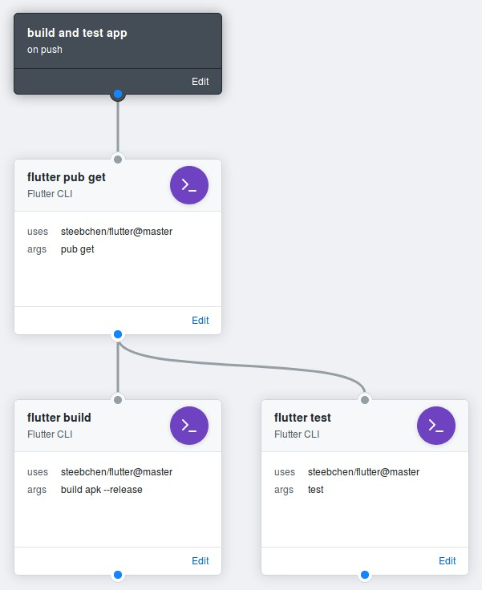

# Github Action for Flutter CLI

This action provides `flutter` for Github Actions.

## Usage examples

This example first fetches the dependencies with `flutter pub get` and then
builds an apk and runs the flutter tests in parallel.

```hcl
workflow "build and test app" {
  on = "push"
  resolves = ["build apk", "run tests"]
}

# Install dependencies
action "install dependencies" {
  uses = "steebchen/flutter@master"
  args = "pub get"
}

# test app
action "run tests" {
  needs = "install dependencies"
  uses = "steebchen/flutter@master"
  args = "test"
}

# Build APK
action "build apk" {
  needs = "install dependencies"
  uses  = "steebchen/flutter@master"
  args  = "build apk --release"
}
```


